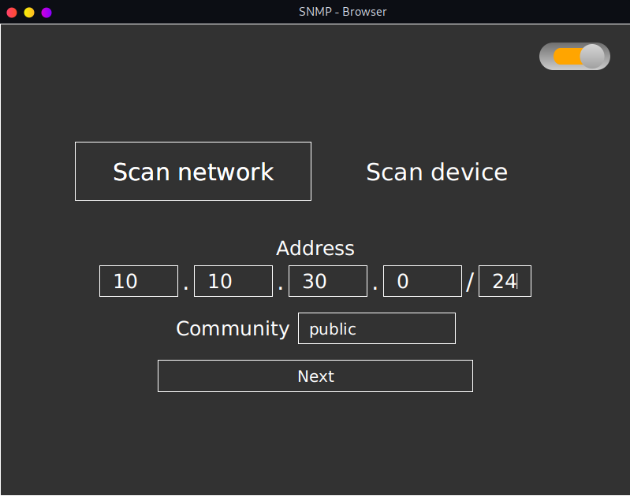
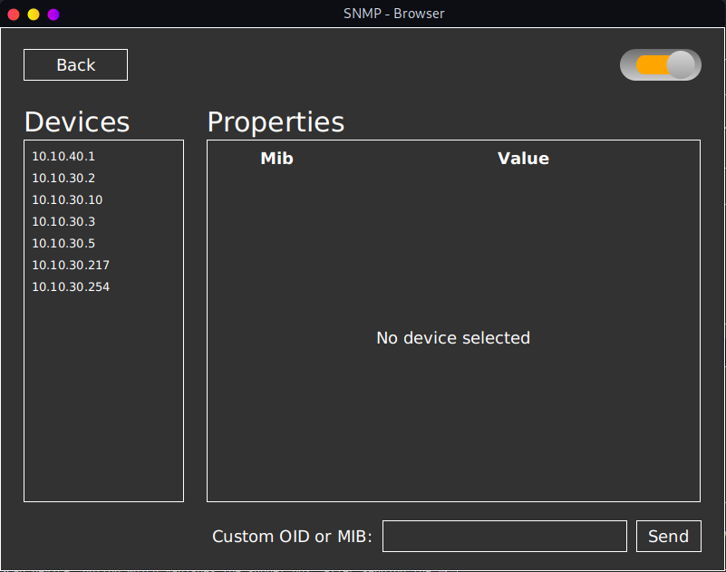

# General
## GUI

## About
This is a simple SNMP-Browser that lets you scan either a network or a specific device in your network. The Browser is
able to show all the scanned devices and their properties. It is also possible to scan a device for a custom specified 
Mib or OID.

## Installation
To run this program, you first need to install all the dependencies, to do so, you just have to install Maven and execute
the command `mvn install`. Then we are able to simply run the java application how we are used to (for example with our 
IDE of choice or via the commandline).

Alternatively we can also execute the jar by executing the command `java -jar <filename>` in the jar's directory. 
(Note that you need Java 1.8 for this to work)

# SNMP-Browser
## Scan network
The Browser is able to scan a whole network, this is also the default setting. If you want to scan a network, you have
to insert the starting ip address, and the subnet of the network. Then a list of devices appears which can be selected 
to show the devices properties.

## Scan device
To scan a device you have to select the "Scan device" button which vanishes the subnet box. After sending the request 
the properties of the device appear in the table.
